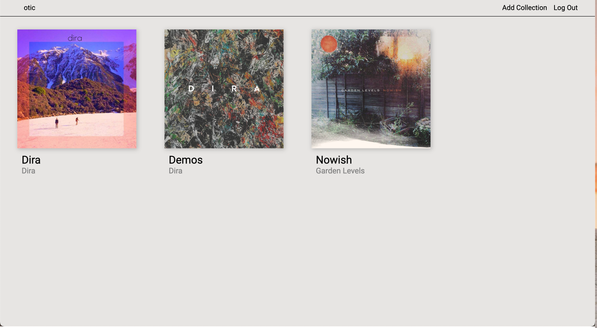
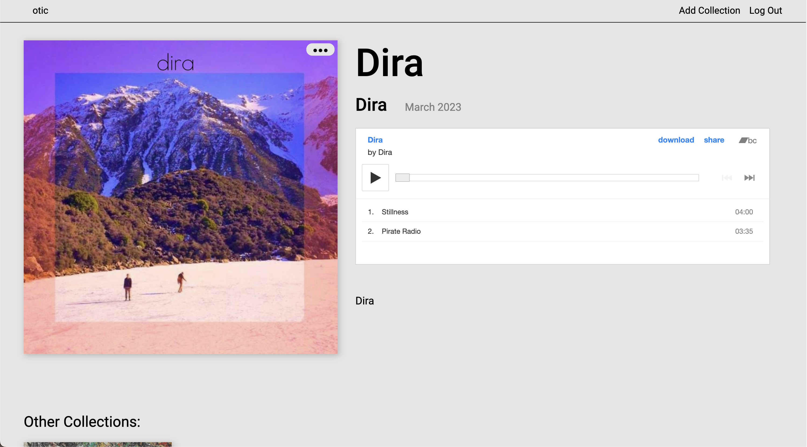

 # OTIC

  ## Introduction

Welcome to OTIC, a music platform for musicians to share their music.

This application allows musicians and users to sign up for an account. Musicians can create new "collections" with an embed of their music from bandcamp. If granted creater rights, musicians can upload their music to the Otic database.

 

## Screen Shots  

 

## Technologies
##### Ideation & Design
  
  
  

##### Development
  

  
  
  
  

  
  

##### Data
  
  
  

##### Deployment
  
  
  

 

## Getting Started

[Deploy App](https://otic.herokuapp.com/)

[View Project Planning](https://trello.com/b/7FtAGpaj/otic)

 

## Next Steps

- Profile Pages
- Favoriting of Collections
- Collections Filtering
- Search Bar

 